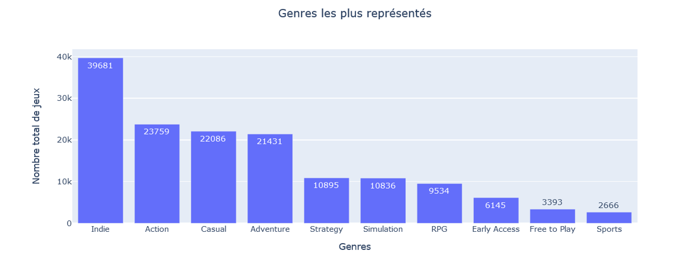

# Analyse exploratoire de données

## Projet Big Data : Analyse du marché de jeux vidéo Steam

La question que l'on cherche à répondre est la suivante. Quels sont les facteurs de popularité et de ventes d'un jeu vidéo ?

- Source de données : un fichier JSON chargé avec Spark : spark.read.format('json').load('chemin_du_fichier/nom_du_fichier.json')
- 55691 jeux
- 22 caractéristiques

### Nettoyage

- Fichier JSON avec des champs imbriqués dans 'data' : sélectionner les différents champs avec getField('nom_du_champ')
- Langues / genres de jeux : sous forme de listes
- Systèmes d’exploitation : sous forme de dictionnaires {'linux': vrai, 'windows': vrai, 'macOS': faux}
- Utiliser F.explode() et F.split() pour isoler les éléments

### Analyse macroscopique du marché

L'éditeur avec le plus de jeux est Big Fish Games. C'est une société qui offre des jeux téléchargeables et des jeux gratuits en ligne ou "casual games", donc il ne s'agit pas de grosses licences.

Les ventes sur Steam ont tendance à globalement augmenter à partir de 2013 (augmentation due à la montée en popularité de Steam) mais semble arriver à un plateau. Les années où il y a eu le plus de ventes sont 2020 et 2021, qui coïncident avec le COVID et le confinement.

Une manière d'interpréter ce graphique est qu'il y a 75% de jeux dont le prix est supérieur à 100 dollars, et 25% de jeux dont le prix est supérieur à 1000 dollars, et la moitié dont le prix se situe entre 100 et 1000 dollars. La médiane des prix est de 500 dollars. La plupart des jeux se vend donc relativement cher, certains prix montent même jusqu'à plus de 2000 dollars.

Peu de jeux (4.5%) bénéficient de remise.

La langue la plus représentée est évidemment l'anglais, suivie par l'allemand, le français et le russe. Des langues parlées énormément dans le monde comme le chinois mandarin, le japonais ou l'espagnol sont étonnament sous-représentées, alors qu'il y aurait un intérêt certain d'inclure ces langues pour ouvrir le marché à énormément de clients potentiels.

On a modifié certaines valeurs non numériques (ex: '7+') et exclu, par souci de visibilité, les 55030 jeux qui n'ont pas de restriction d'âge, ainsi que les valeurs aberrantes (ex: '180'). On constate que les âges requis indiqués sont en grande majorité 15 ans et 18 ans et surtout que les restrictions d'âge sont donc rarement indiquées.

### Analyse par genres de jeux

Les genres les plus représentés sont les jeux indépendants, l'action, les jeux casuals, l'aventure et la stratégie.

En calculant le ratio d'avis positifs sur le nombre total d'avis, on obtient un classement étonnant puisqu'il concerne des genres peu représentés : l'édition de photos, l'animation & modeling, le design & illustration. On retrouve néanmoins les jeux indépendants et les casuals dans les 10 premières places.

Les genres les plus lucratifs sont l'action et l'aventure, suivis des jeux indépendants et du RPG.

### Analyse par systèmes d'exploitation

La majorité des jeux sont sur Windows.

On constate que Windows est le système d'exploitation le plus courant sur les 10 genres les plus populaires.

### Conclusions de l'analyse

L'analyse des jeux sur Steam a permis d'identifier certains points pour augmenter la popularité et les ventes d'un jeu vidéo sur Steam :
- les genres les mieux notés, comme l'édition de photos, ne sont pas forcément les plus lucratifs, donc si on est un grand éditeur de jeux avec un objectif économique, mieux vaut se concentrer sur des jeux ayant des genres plus lucratifs et pas forcément mieux notés en terme de ratio avis positifs sur nombre d'avis total ;
- en termes de représentativité, il y a principalement des jeux indépendants, des jeux d'action, des jeux casuals, des jeux d'aventure et des jeux de stratégie : pour se distinguer, mieux vaut donc éviter des genres trop représentés ;
- le genre indépendant est néanmoins populaire et vendeur : un grand éditeur a tout intérêt à proposer un partenariat avec un jeu indépendant ;
- concernant les langues, augmenter sa visibilité, notamment en proposant une traduction des jeux en chinois, en japonais ou en espagnol, serait une bonne idée pour s'ouvrir aux marchés asiatique et sud-américain.
